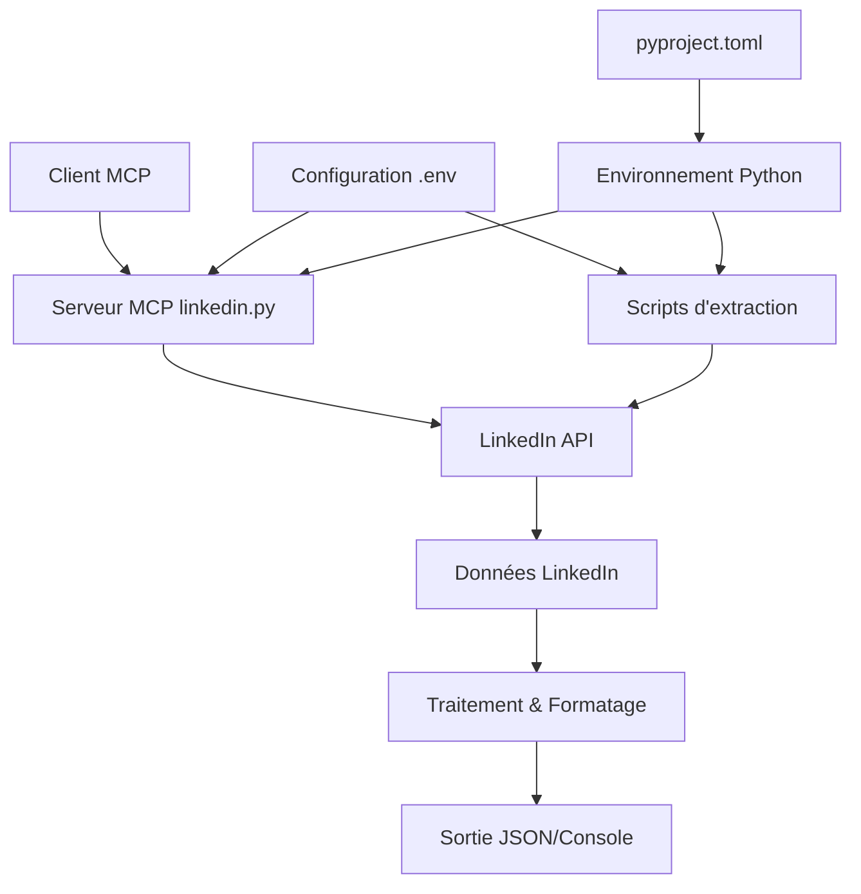

# 🏗️ Architecture du projet LinkedIn Job Search MCP

## 🎯 Vue d'ensemble architecturale

Le projet est structuré autour de plusieurs composants clés qui interagissent pour fournir une solution complète d'extraction et d'analyse des données d'emploi LinkedIn.



## 📁 Structure des fichiers

```
linkedin-mcp/
├── src/                    # Code source principal
│   ├── __init__.py        # Module Python
│   └── linkedin.py        # Serveur MCP principal
├── scripts/               # Scripts d'extraction (implicite)
│   ├── final_search.py         # Recherche avec debug
│   ├── final_search_clean.py   # Recherche optimisée
│   ├── complete_extraction.py  # Extraction complète
│   └── explore_all_data.py     # Exploration données
├── config/                # Configuration
│   ├── .env              # Variables d'environnement
│   └── pyproject.toml    # Configuration Python
├── docker/               # Déploiement
│   ├── Dockerfile        # Image Docker
│   └── smithery.yaml     # Configuration Smithery
├── data/                 # Données générées (implicite)
│   ├── *.json           # Résultats d'extraction
│   └── logs/            # Logs d'exécution
├── docs/                # Documentation
└── venv/                # Environnement virtuel Python
```

## 🔧 Composants principaux

### 1. **Serveur MCP** (`src/linkedin.py`)

Le serveur MCP est le composant central qui expose les fonctionnalités via le protocol MCP.

#### Outils MCP disponibles :

```python
@mcp.tool()
def get_profile():
    """Récupère le profil utilisateur connecté"""

@mcp.tool()
def get_feed_posts(limit: int = 10, offset: int = 0):
    """Récupère les posts du feed LinkedIn"""

@mcp.tool() 
def search_jobs(keywords: str, location: str = None, limit: int = 10):
    """Recherche d'emplois avec critères personnalisables"""

@mcp.tool()
def get_job_details(job_id: str):
    """Récupère les détails complets d'un emploi spécifique"""
```

#### Architecture interne :

```python
# Authentification centralisée
def get_creds():
    return Linkedin(
        os.getenv("LINKEDIN_EMAIL"), 
        os.getenv("LINKEDIN_PASSWORD"), 
        debug=True
    )

# Gestion d'erreurs uniforme
try:
    # Opération LinkedIn
    result = linkedin.operation()
    return json.dumps(result, ensure_ascii=False)
except Exception as e:
    return f"Erreur: {str(e)}"
```

### 2. **Scripts d'extraction**

#### A. **final_search.py** - Recherche avec debug
- **Rôle** : Recherche d'emplois avec informations de débogage détaillées
- **Sortie** : Console avec debug + JSON basique
- **Usage** : Développement et diagnostic

#### B. **final_search_clean.py** - Recherche optimisée  
- **Rôle** : Recherche d'emplois avec extraction propre
- **Sortie** : Console formatée + JSON basique
- **Usage** : Production basique

#### C. **complete_extraction.py** - Extraction complète
- **Rôle** : Extraction exhaustive de toutes les données disponibles
- **Sortie** : JSON structuré complet (65Ko+ par batch)
- **Usage** : Analyse approfondie et archivage

#### D. **explore_all_data.py** - Exploration
- **Rôle** : Analyse de la structure des données LinkedIn
- **Sortie** : Structure hiérarchique détaillée
- **Usage** : Développement et compréhension de l'API

### 3. **Couche de données**

#### Structure des données extraites :

```json
{
  "search_result_data": {
    "trackingUrn": "urn:li:jobPosting:ID",
    "title": "Titre du poste",
    "entityUrn": "urn:li:fsd_jobPosting:ID",
    "contentSource": "JOBS_PREMIUM"
  },
  "detailed_data": {
    "basic_info": {
      "title": "Titre complet",
      "job_id": 123456789,
      "entity_urn": "urn:li:fs_normalized_jobPosting:ID",
      "job_state": "LISTED"
    },
    "company": {
      "name": "Nom entreprise",
      "logo_urls": [{"size": "200x200", "url": "..."}]
    },
    "description": {
      "text": "Description complète...",
      "formatting_details": {}
    },
    "workplace": {
      "types": ["urn:li:fs_workplaceType:2"],
      "detailed_types": [{"localized_name": "Remote"}]
    },
    "apply_method": {
      "type": "com.linkedin.voyager.jobs.ComplexOnsiteApply",
      "apply_url": "https://linkedin.com/job-apply/ID"
    }
  }
}
```

## 🔄 Flux de données

### 1. **Flux d'authentification**
```
.env → get_creds() → LinkedIn(email, password) → Session authentifiée
```

### 2. **Flux de recherche**
```
Paramètres recherche → search_jobs() → API LinkedIn → Résultats bruts → Traitement → JSON/Console
```

### 3. **Flux d'extraction détaillée**
```
Job ID → get_job() → API LinkedIn → Données complètes → Extraction structurée → JSON enrichi
```

### 4. **Flux MCP**
```
Client MCP → Serveur MCP → LinkedIn API → Traitement → Réponse MCP → Client
```

## ⚙️ Configuration et environnement

### Variables d'environnement (.env)
```env
LINKEDIN_EMAIL=user@example.com
LINKEDIN_PASSWORD=password123
```

### Configuration Python (pyproject.toml)
```toml
[project]
name = "linkedin-mcp"
version = "1.0.0"
dependencies = [
    "linkedin-api>=2.3.1",
    "python-dotenv>=1.1.1",
    "fastmcp"
]
```

### Configuration MCP
```json
{
    "mcpServers": {
        "linkedin": {
            "command": "/path/to/venv/bin/python",
            "args": ["/path/to/src/linkedin.py"],
            "env": {
                "PYTHONPATH": "/path/to/src"
            }
        }
    }
}
```

## 🔒 Sécurité

### 1. **Gestion des identifiants**
- Variables d'environnement sécurisées
- Fichier `.env` exclu du contrôle de version
- Pas d'identifiants en dur dans le code

### 2. **Gestion des erreurs**
- Try/catch global sur toutes les opérations
- Logs d'erreurs sans exposition des identifiants
- Gestion des timeouts et rate limits

### 3. **Respect des limites**
- Rate limiting implicite via l'API
- Limits configurables sur les requêtes
- Gestion des sessions expirées

## 📊 Performance

### Métriques typiques :
- **Recherche basique** : ~2-3 secondes pour 10 emplois
- **Extraction complète** : ~5-10 secondes pour 10 emplois
- **Données générées** : 6-7 Ko par emploi en extraction complète
- **Mémoire** : ~50-100 MB en utilisation normale

### Optimisations :
- Réutilisation des sessions LinkedIn
- Cache implicite via l'API
- Traitement séquentiel pour respecter les limites

## 🚀 Déploiement

### Local
```bash
python final_search_clean.py
```

### Docker
```bash
docker build -t linkedin-mcp .
docker run linkedin-mcp
```

### MCP Server
```bash
mcp run linkedin
```

## 🔄 Évolutivité

### Extensions possibles :
1. **Cache Redis** pour les résultats
2. **Base de données** pour l'historique
3. **API REST** pour l'accès HTTP
4. **Interface web** pour la visualisation
5. **Notifications** pour les nouvelles offres
6. **ML/Analytics** pour l'analyse prédictive

---

*Architecture documentée - Version 1.0 - Août 2025*