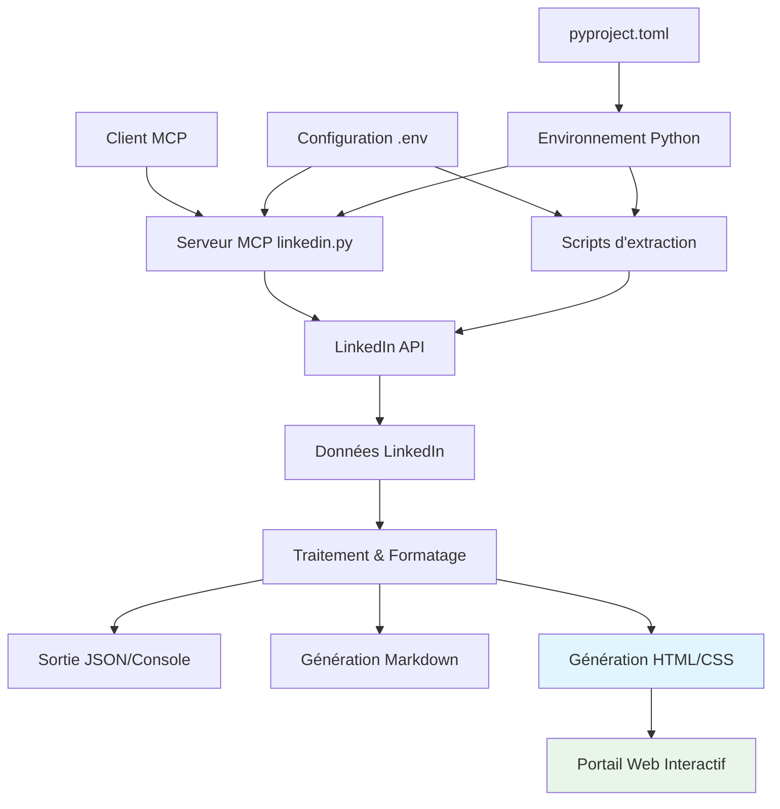
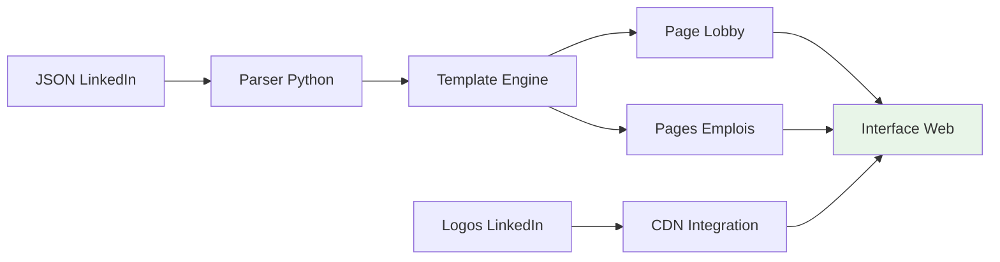

# 🏗️ Architecture du projet LinkedIn Job Search MCP

## 🎯 Vue d'ensemble architecturale

Le projet est structuré autour de plusieurs composants clés qui interagissent pour fournir une solution complète d'extraction et d'analyse des données d'emploi LinkedIn.



## 📁 Structure des fichiers

```
linkedin-mcp/
├── src/linkedin_mcp/      # Code source principal
│   ├── __init__.py       # Module Python
│   ├── server.py         # Serveur MCP principal
│   ├── search_clean.py   # Module de recherche optimisée
│   └── extraction_complete.py  # Module d'extraction complète
├── scripts/              # Scripts organisés par catégorie
│   ├── basic/           # Scripts de base
│   │   ├── final_search.py
│   │   ├── test_search.py
│   │   └── test_search_enhanced.py
│   ├── production/      # Scripts de production
│   └── development/     # Scripts de développement
│       └── explore_data.py
├── config/              # Configuration
│   ├── .env            # Variables d'environnement
│   ├── pyproject.toml  # Configuration Python
│   ├── Dockerfile      # Image Docker
│   └── smithery.yaml   # Configuration Smithery
├── data/               # Données générées
│   ├── exports/        # Fichiers finaux
│   │   ├── *.json     # Données JSON complètes
│   │   ├── *.md       # Rapports Markdown
│   │   └── *.html     # Portail web
│   ├── temp/          # Fichiers temporaires
│   └── samples/       # Exemples de données
├── docs/              # Documentation complète
│   ├── README.md      # Vue d'ensemble
│   ├── INDEX.md       # Index navigation
│   ├── portal_html.md # Doc portail HTML
│   └── [autres docs]
├── logs/              # Logs d'exécution
├── run_*.py          # Scripts d'entrée racine
└── venv/             # Environnement virtuel Python
```

## 🔧 Composants principaux

### 1. **Serveur MCP** (`src/linkedin.py`)

Le serveur MCP est le composant central qui expose les fonctionnalités via le protocol MCP.

#### Outils MCP disponibles :

```python
@mcp.tool()
def get_profile():
    """Récupère le profil utilisateur connecté"""

@mcp.tool()
def get_feed_posts(limit: int = 10, offset: int = 0):
    """Récupère les posts du feed LinkedIn"""

@mcp.tool() 
def search_jobs(keywords: str, location: str = None, limit: int = 10):
    """Recherche d'emplois avec critères personnalisables"""

@mcp.tool()
def get_job_details(job_id: str):
    """Récupère les détails complets d'un emploi spécifique"""
```

#### Architecture interne :

```python
# Authentification centralisée
def get_creds():
    return Linkedin(
        os.getenv("LINKEDIN_EMAIL"), 
        os.getenv("LINKEDIN_PASSWORD"), 
        debug=True
    )

# Gestion d'erreurs uniforme
try:
    # Opération LinkedIn
    result = linkedin.operation()
    return json.dumps(result, ensure_ascii=False)
except Exception as e:
    return f"Erreur: {str(e)}"
```

### 2. **Scripts d'extraction**

#### A. **final_search.py** - Recherche avec debug
- **Rôle** : Recherche d'emplois avec informations de débogage détaillées
- **Sortie** : Console avec debug + JSON basique
- **Usage** : Développement et diagnostic

#### B. **final_search_clean.py** - Recherche optimisée  
- **Rôle** : Recherche d'emplois avec extraction propre
- **Sortie** : Console formatée + JSON basique
- **Usage** : Production basique

#### C. **complete_extraction.py** - Extraction complète
- **Rôle** : Extraction exhaustive de toutes les données disponibles
- **Sortie** : JSON structuré complet (65Ko+ par batch)
- **Usage** : Analyse approfondie et archivage

#### D. **explore_all_data.py** - Exploration
- **Rôle** : Analyse de la structure des données LinkedIn
- **Sortie** : Structure hiérarchique détaillée
- **Usage** : Développement et compréhension de l'API

### 3. **Couche de données**

#### Structure des données extraites :

```json
{
  "search_result_data": {
    "trackingUrn": "urn:li:jobPosting:ID",
    "title": "Titre du poste",
    "entityUrn": "urn:li:fsd_jobPosting:ID",
    "contentSource": "JOBS_PREMIUM"
  },
  "detailed_data": {
    "basic_info": {
      "title": "Titre complet",
      "job_id": 123456789,
      "entity_urn": "urn:li:fs_normalized_jobPosting:ID",
      "job_state": "LISTED"
    },
    "company": {
      "name": "Nom entreprise",
      "logo_urls": [{"size": "200x200", "url": "..."}]
    },
    "description": {
      "text": "Description complète...",
      "formatting_details": {}
    },
    "workplace": {
      "types": ["urn:li:fs_workplaceType:2"],
      "detailed_types": [{"localized_name": "Remote"}]
    },
    "apply_method": {
      "type": "com.linkedin.voyager.jobs.ComplexOnsiteApply",
      "apply_url": "https://linkedin.com/job-apply/ID"
    }
  }
}
```

## 🔄 Flux de données

### 1. **Flux d'authentification**
```
.env → get_creds() → LinkedIn(email, password) → Session authentifiée
```

### 2. **Flux de recherche**
```
Paramètres recherche → search_jobs() → API LinkedIn → Résultats bruts → Traitement → JSON/Console
```

### 3. **Flux d'extraction détaillée**
```
Job ID → get_job() → API LinkedIn → Données complètes → Extraction structurée → JSON enrichi
```

### 4. **Flux MCP**
```
Client MCP → Serveur MCP → LinkedIn API → Traitement → Réponse MCP → Client
```

### 5. **Flux de génération multi-format** (Nouveau - 2025)
```
JSON Extraction → Parsing → [Markdown|HTML] → Fichiers formatés → Interface web
```

### 6. **Flux portail HTML** (Nouveau - 2025)
```
Données LinkedIn → Extraction logos → Template HTML → CSS moderne → Portail interactif
```

## ⚙️ Configuration et environnement

### Variables d'environnement (.env)
```env
LINKEDIN_EMAIL=user@example.com
LINKEDIN_PASSWORD=password123
```

### Configuration Python (pyproject.toml)
```toml
[project]
name = "linkedin-mcp"
version = "1.0.0"
dependencies = [
    "linkedin-api>=2.3.1",
    "python-dotenv>=1.1.1",
    "fastmcp"
]
```

### Configuration MCP
```json
{
    "mcpServers": {
        "linkedin": {
            "command": "/path/to/venv/bin/python",
            "args": ["/path/to/src/linkedin.py"],
            "env": {
                "PYTHONPATH": "/path/to/src"
            }
        }
    }
}
```

## 🔒 Sécurité

### 1. **Gestion des identifiants**
- Variables d'environnement sécurisées
- Fichier `.env` exclu du contrôle de version
- Pas d'identifiants en dur dans le code

### 2. **Gestion des erreurs**
- Try/catch global sur toutes les opérations
- Logs d'erreurs sans exposition des identifiants
- Gestion des timeouts et rate limits

### 3. **Respect des limites**
- Rate limiting implicite via l'API
- Limits configurables sur les requêtes
- Gestion des sessions expirées

## 📊 Performance

### Métriques typiques :
- **Recherche basique** : ~2-3 secondes pour 10 emplois
- **Extraction complète** : ~5-10 secondes pour 10 emplois
- **Données générées** : 6-7 Ko par emploi en extraction complète
- **Mémoire** : ~50-100 MB en utilisation normale

### Optimisations :
- Réutilisation des sessions LinkedIn
- Cache implicite via l'API
- Traitement séquentiel pour respecter les limites

## 🚀 Déploiement

### Local
```bash
python final_search_clean.py
```

### Docker
```bash
docker build -t linkedin-mcp .
docker run linkedin-mcp
```

### MCP Server
```bash
mcp run linkedin
```

## 🔄 Évolutivité

### Extensions possibles :
1. **Cache Redis** pour les résultats
2. **Base de données** pour l'historique
3. **API REST** pour l'accès HTTP
4. **Interface web** pour la visualisation
5. **Notifications** pour les nouvelles offres
6. **ML/Analytics** pour l'analyse prédictive

## 🌐 Architecture du portail HTML (Nouveau - Août 2025)

### 🏗️ Vue d'ensemble
Le portail HTML transforme les données JSON extraites en interface web moderne pour la navigation entre les offres d'emploi.

### 📊 Pipeline de génération


### 🎨 Architecture CSS moderne
```css
/* Système de design hiérarchique */
:root {
  --primary: #2196F3;
  --gradient: linear-gradient(135deg, #667eea 0%, #764ba2 100%);
  --shadow: 0 20px 60px rgba(0,0,0,0.1);
  --radius: 15px;
}

/* Grid responsif natif */
.jobs-grid {
  display: grid;
  grid-template-columns: repeat(auto-fit, minmax(350px, 1fr));
  gap: 30px;
}
```

### 🔧 Composants techniques

#### 1. **Générateur de lobby** 
- **Fonction** : `create_lobby_page(jobs_info)`
- **Template** : Grid de cartes avec statistiques
- **Assets** : Logos d'entreprises + métadonnées
- **Output** : `index.html` (12KB avec CSS intégré)

#### 2. **Générateur de pages emploi**
- **Fonction** : `create_job_html(job_data, index)`  
- **Template** : Header + info cards + description + CTA
- **Assets** : Logo 200x200px + lien candidature
- **Output** : `job_*.html` (8KB chacune)

#### 3. **Système de templating**
```python
def get_css_styles():
    """CSS moderne avec animations intégrées"""
    return """
    * { box-sizing: border-box; }
    body { 
        background: linear-gradient(135deg, #667eea 0%, #764ba2 100%);
        font-family: 'Segoe UI', sans-serif;
    }
    .container { 
        max-width: 900px;
        box-shadow: 0 20px 60px rgba(0,0,0,0.1);
        border-radius: 15px;
        animation: slideUp 0.6s ease-out;
    }
    """
```

### 📱 Architecture responsive

#### Breakpoints système
```css
/* Mobile First */
.container { width: 95%; }

/* Tablet */
@media (min-width: 768px) {
    .info-grid { grid-template-columns: repeat(2, 1fr); }
}

/* Desktop */
@media (min-width: 1024px) {
    .jobs-grid { grid-template-columns: repeat(3, 1fr); }
}
```

### 🎯 Intégration des données LinkedIn

#### Structure des données consommées
```python
# Données minimales requises pour le portail
required_data = {
    'title': job_data['detailed_data']['basic_info']['title'],
    'company': job_data['detailed_data']['company']['name'],
    'logo_url': job_data['detailed_data']['company']['logo_urls'][0]['url'],
    'location': job_data['detailed_data']['workplace']['formatted_location'],
    'description': job_data['detailed_data']['description']['text'],
    'apply_url': job_data['detailed_data']['apply_method']['apply_url']
}
```

#### Gestion des fallbacks
```python
# Logo fallback automatique
logo_fallback = f"<div style='color: #2196F3; font-weight: bold;'>{company[0]}</div>"

# URL fallback
apply_url = job_data.get('apply_url') or 'https://linkedin.com'
```

### ⚡ Performance et optimisation

#### Métriques de performance
- **Page lobby** : 12KB (CSS intégré, pas de dépendances externes)
- **Pages emploi** : 8KB chacune (optimisation images CDN LinkedIn)
- **Temps de génération** : <2s pour 3 pages complètes
- **Compatible** : IE11+, tous navigateurs modernes

#### Optimisations techniques
```python
# CSS intégré pour éliminer les requêtes HTTP
html_content = f"""
<head>
    <style>{get_css_styles()}</style>
</head>
"""

# Images optimisées via CDN LinkedIn
logo_url = company['logo_urls'][0]['url']  # 200x200 optimal
```

### 🔒 Sécurité et bonnes pratiques

#### Sanitisation des données
```python
# Échappement HTML automatique
import html
safe_title = html.escape(job_data['title'])
safe_description = html.escape(job_data['description'])
```

#### CSP et sécurité
- **Pas de JavaScript** : HTML/CSS pur, pas de surface d'attaque
- **URLs externes** : Vérification des domaines LinkedIn/entreprises
- **Content Type** : `text/html; charset=utf-8`

### 🚀 Extensibilité future

#### Fonctionnalités planifiées
```javascript
// Recherche côté client
const searchFunction = (query) => {
    // Filtrage des offres en temps réel
}

// Système de favoris
const bookmarkSystem = {
    save: (jobId) => localStorage.setItem(`fav_${jobId}`, true),
    load: () => JSON.parse(localStorage.getItem('bookmarks') || '[]')
}
```

#### Architecture modulaire
```python
# Système de thèmes
themes = {
    'corporate': {'primary': '#1e3c72', 'secondary': '#2a5298'},
    'creative': {'primary': '#667eea', 'secondary': '#764ba2'},
    'minimal': {'primary': '#2c3e50', 'secondary': '#34495e'}
}
```

---

*Architecture documentée - Version 1.1 - Août 2025*
*Mise à jour : Portail HTML + Extraction enrichie*