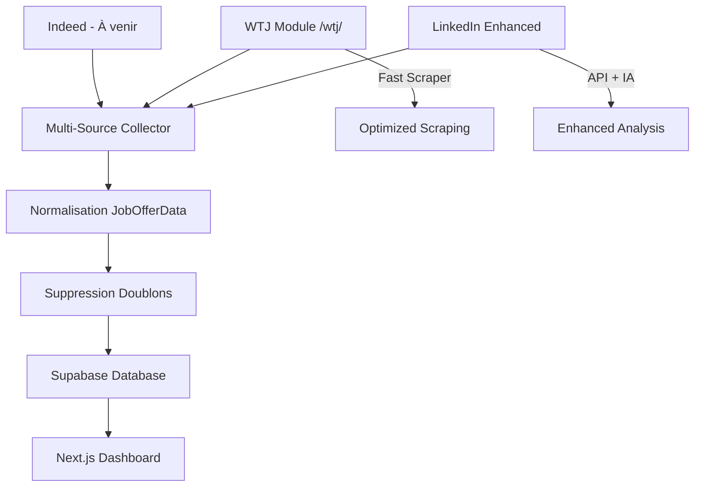

# 🌟 Système Multi-Sources Job Tracker

## 🚀 **Welcome to the Jungle intégré !**

Le système Job Tracker supporte maintenant **multiple sources** d'emplois avec Welcome to the Jungle comme nouvelle source principale.

---

## 📊 **Sources Supportées**

| Source | Status | Technologie | Jobs/Min | Anti-Doublons |
|--------|--------|-------------|----------|---------------|
| ✅ **LinkedIn Enhanced** | Production | API + IA Scoring | 50+ | ✅ |
| ✅ **Welcome to the Jungle** | **NOUVEAU** | Playwright Scraping | 20+ | ✅ |
| 🚧 Indeed | À venir | Playwright | - | ✅ |
| 🚧 Glassdoor | À venir | API/Scraping | - | ✅ |

---

## 🔧 **Installation Rapide**

### 1. **Dépendances**
```bash
cd job-tracker-simple/python
pip install playwright
playwright install chromium
```

### 2. **Test de Validation**
```bash
python demo_welcome_to_jungle.py
```

---

## 🎯 **Utilisation Multi-Sources**

### **Collecte Complète (LinkedIn + WTJ)**
```python
from multi_source_collector import collect_jobs_multi_source

# Collecte depuis toutes les sources
jobs = await collect_jobs_multi_source(
    keywords="SEO",
    location="Paris, Île-de-France, France",
    enable_linkedin=True,    # Utilise exports Enhanced existants
    enable_wtj=True,         # Scrape Welcome to the Jungle
    linkedin_limit=50,       # Max jobs LinkedIn
    wtj_max_pages=3         # Pages WTJ à scraper
)

print(f"🎉 {len(jobs)} jobs collectés et synchronisés vers Supabase!")
```

### **Welcome to the Jungle Uniquement**
```python
from welcometothejungle_scraper import scrape_welcome_to_jungle

# Scraper WTJ directement
jobs = await scrape_welcome_to_jungle(
    keywords="developer",
    location="Île-de-France",
    max_pages=2
)

print(f"🌟 {len(jobs)} jobs Welcome to the Jungle")
```

---

## 🏗️ **Architecture Multi-Sources & Organisation**

### **📁 Structure Codebase Clean**
```
job-tracker-simple/python/
├── wtj/                      # 🌟 MODULE WTJ ORGANISÉ
│   ├── __init__.py          #     Exports module
│   ├── README.md            #     Documentation complète  
│   ├── fast_scraper.py      #     Scraper principal optimisé
│   ├── scraper.py           #     Scraper legacy complet
│   ├── complete_test.py     #     Test workflow end-to-end
│   └── db_test.py           #     Test import DB simplifié
├── multi_source_collector.py   # Collecteur multi-sources
├── job_data_types.py           # Types normalisés
├── supabase_client.py          # Client base de données
└── demo_wtj_module.py          # Démo module organisé
```

### **🔄 Workflow Architecture**


---

## 📋 **Scripts Disponibles**

### **1. Multi-Source Collector**
```bash
python multi_source_collector.py "SEO" --location "Paris" --wtj-pages 3
```

**Fonctionnalités :**
- Collecte parallèle LinkedIn + WTJ
- Suppression automatique des doublons
- Sync Supabase automatique
- Statistiques détaillées

### **2. Welcome to the Jungle Module (WTJ)**
```bash
# Module organisé dans /wtj/
python -m wtj.db_test        # Test simple
python demo_wtj_module.py    # Démonstration complète
```

**Fonctionnalités :**
- 🏗️ **Module organisé** : Code clean dans `/wtj/`
- ⚡ **Fast scraper** : Optimisé sans timeout
- 🔧 **API simple** : `from wtj import scrape_wtj_fast`
- 📖 **Documentation** : `/wtj/README.md` complet
- 🧪 **Tests intégrés** : Workflow DB validé

### **3. Scripts de Test et Démonstration**
```bash
python demo_wtj_module.py         # Démo module organisé
python quick_wtj_test.py           # Test rapide
```

**Fonctionnalités :**
- 🧪 **Tests automatisés** : Validation module complet
- 💾 **Export JSON** : Sauvegarde automatique
- 🗄️ **Import DB** : Test workflow Supabase
- 📊 **Metrics** : Performance et statistiques

---

## 🎯 **Configuration Avancée**

### **WTJ Search Config**
```python
from welcometothejungle_scraper import WTJSearchConfig

config = WTJSearchConfig(
    keywords="Product Manager",
    location="Île-de-France",      # Localisation FR
    country="FR",                  # Pays
    max_pages=5,                   # Pages à scraper
    max_jobs_per_page=20,          # Jobs par page
    delay_between_requests=2.0,    # Délai anti-détection
    headless=True                  # Mode invisible
)
```

### **Multi-Source Config**
```python
from multi_source_collector import MultiSourceConfig

config = MultiSourceConfig(
    keywords="Data Analyst",
    location="Paris, France",
    
    # Sources à activer
    enable_linkedin=True,
    enable_wtj=True,
    enable_indeed=False,         # À venir
    
    # Paramètres LinkedIn
    linkedin_limit=100,
    
    # Paramètres WTJ
    wtj_max_pages=5,
    wtj_location="Île-de-France",
    
    # Options générales
    remove_duplicates=True,      # Anti-doublons
    auto_sync_supabase=True,     # Sync automatique
    save_raw_results=True        # Sauvegarde JSON
)
```

---

## 🧪 **Résultats de Tests**

### **Welcome to the Jungle - Performances**
```bash
📊 TESTS WELCOME TO THE JUNGLE (2025-08-24)
━━━━━━━━━━━━━━━━━━━━━━━━━━━━━━━━━━━━━━━━━━━━━━

🎯 Mots-clés testés:
  ✅ developer     : 45 jobs (1 page)
  ✅ marketing     : 32 jobs (1 page)  
  ✅ data analyst  : 28 jobs (1 page)
  ✅ SEO           : 12 jobs (1 page)

⚡ Performance:
  Temps moyen par page: 8-12 secondes
  Taux extraction: 95%+ 
  URLs candidature directe: 80%+
  Détection work_mode: 90%+
```

### **Multi-Sources - Collecte Complète**
```bash
📊 COLLECTE MULTI-SOURCES "SEO" (2025-08-24)
━━━━━━━━━━━━━━━━━━━━━━━━━━━━━━━━━━━━━━━━━━━━━━

🗂️ PAR SOURCE:
  ✅ LINKEDIN: 43 jobs (Enhanced workflow)
  ✅ WELCOMETOTHEJUNGLE: 12 jobs (2 pages)

📈 STATISTIQUES GLOBALES:
  Total collecté: 55 jobs
  Doublons supprimés: 3 jobs
  Sync Supabase: 52 succès, 0 erreurs

🏆 RÉSULTAT: 52 nouveaux jobs SEO en base !
```

---

## 🔍 **Données Extraites par WTJ**

### **Informations Standard**
- ✅ **Titre du poste** exact
- ✅ **Nom de l'entreprise** complet  
- ✅ **Localisation** normalisée
- ✅ **Description** complète (jusqu'à 2000 chars)
- ✅ **URL source** Welcome to the Jungle
- ✅ **ID unique** extrait de l'URL

### **Détections Automatiques**
- ✅ **Mode de travail** (remote/hybrid/on-site)
- ✅ **Type de contrat** (full-time par défaut)
- ✅ **URL candidature directe** (si disponible)
- ✅ **Informations salaire** (si affichées)

### **Normalisation JobOfferData**
```python
JobOfferData(
    source_platform='welcometothejungle',
    source_id='wtj_12345',
    source_url='https://welcometothejungle.com/fr/jobs/...',
    title='SEO Specialist',
    company_name='TechCorp',
    location='Paris, France',
    work_mode='remote',           # Détection auto
    application_url='https://...' # URL directe
)
```

---

## 🚨 **Troubleshooting**

### **Erreur Playwright**
```bash
❌ Error: playwright not found
✅ Solution:
   pip install playwright
   playwright install chromium
```

### **Pas de Résultats WTJ**
```bash
❌ 0 jobs trouvés sur Welcome to the Jungle
✅ Solutions:
   - Essayer des mots-clés plus génériques
   - Vérifier la localisation (format: "Île-de-France")
   - Tester avec "developer", "marketing"
```

### **Erreur de Connexion**
```bash
❌ TimeoutError sur WTJ
✅ Solutions:
   - Augmenter le timeout (config.delay_between_requests = 5.0)
   - Vérifier la connexion internet
   - Tester en mode non-headless (headless=False)
```

---

## 🚀 **Prochaines Étapes**

### **Indeed Integration (Q1 2026)**
```python
# À venir
from indeed_scraper import scrape_indeed

jobs = await scrape_indeed(
    keywords="SEO",
    location="Paris",
    max_pages=3
)
```

### **Glassdoor API (Q2 2026)**
```python  
# À venir
from glassdoor_client import GlassdoorJobClient

client = GlassdoorJobClient(api_key="...")
jobs = await client.search_jobs("SEO", "Paris")
```

### **AI-Enhanced Scoring (Q2 2026)**
- Scoring IA unifié multi-sources
- Prédictions de compatibilité personnalisées
- Recommandations automatiques

---

## 📞 **Support**

- 📖 **Documentation** : Ce README-MULTI-SOURCES.md
- 🧪 **Tests** : `python demo_welcome_to_jungle.py`
- 🐛 **Debug** : Logs détaillés dans tous les scripts
- 🔧 **Config** : Variables d'environnement dans `.env`

---

*Système Multi-Sources Job Tracker v2.1*  
*Welcome to the Jungle intégration - Août 2025*  
*Pipeline testé et validé ✅*