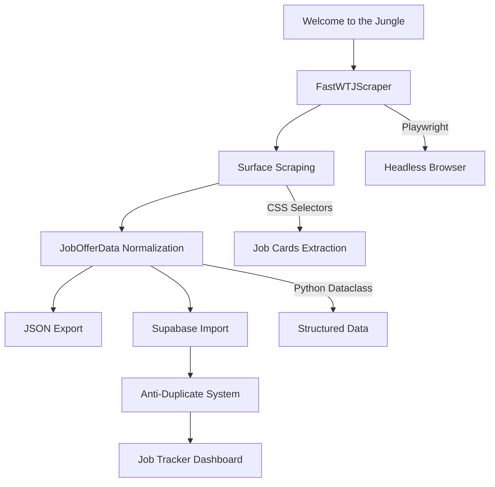
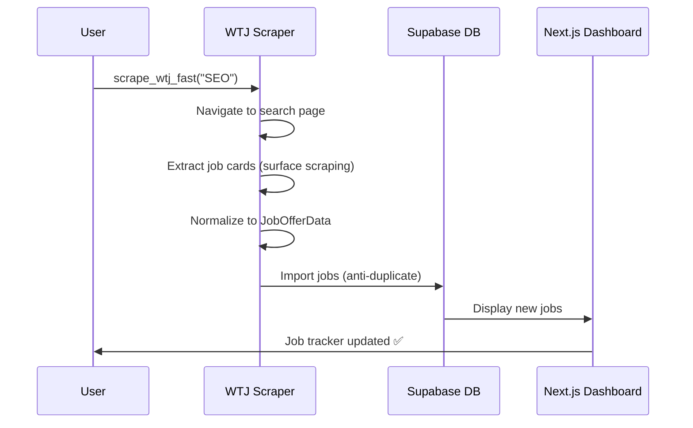

# 🌟 Welcome to the Jungle (WTJ) Scraper Module

Module Python intégré au **Job Tracker multi-sources** pour scraper et normaliser les offres d'emploi depuis [Welcome to the Jungle](https://www.welcometothejungle.com).

---

## 📋 **Table des Matières**

- [🚀 Installation](#-installation)
- [⚡ Usage Rapide](#-usage-rapide)
- [🏗️ Architecture](#%EF%B8%8F-architecture)
- [📂 Structure des Fichiers](#-structure-des-fichiers)
- [🔧 API Reference](#-api-reference)
- [🧪 Tests et Validation](#-tests-et-validation)
- [🎯 Performances](#-performances)
- [🔍 Troubleshooting](#-troubleshooting)

---

## 🚀 **Installation**

### **Prérequis**
```bash
# Installation des dépendances
cd /root/Job/linkedin-mcp
source venv/bin/activate
pip install playwright
playwright install chromium
```

### **Dépendances**
- `playwright` : Web scraping headless
- `job_data_types.py` : Normalisation des données
- `supabase_client.py` : Intégration base de données

---

## ⚡ **Usage Rapide**

### **1. Import Simple**
```python
from wtj import scrape_wtj_fast

# Scraping basique
jobs = await scrape_wtj_fast("SEO", "Île-de-France", max_pages=2)
print(f"✅ {len(jobs)} jobs trouvés")
```

### **2. Configuration Avancée**
```python
from wtj.fast_scraper import FastWTJScraper, WTJFastConfig

config = WTJFastConfig(
    keywords="Data Analyst",
    location="Île-de-France",
    max_pages=3,
    headless=True
)

async with FastWTJScraper(config) as scraper:
    jobs = await scraper.scrape_all_fast()
```

### **3. Workflow Complet avec DB**
```bash
cd /root/Job/linkedin-mcp/job-tracker-simple/python
python wtj/complete_test.py
```

---

## 🏗️ **Architecture**



---

## 📂 **Structure des Fichiers**

```
wtj/
├── __init__.py           # Module exports
├── README.md             # Cette documentation
├── fast_scraper.py       # 🚀 Scraper optimisé (RECOMMANDÉ)
├── scraper.py            # 📋 Scraper complet avec deep analysis
├── complete_test.py      # 🧪 Test workflow complet
└── db_test.py           # 🔧 Test import base de données
```

### **Fichiers Principaux**

| Fichier | Description | Usage |
|---------|-------------|--------|
| `fast_scraper.py` | **Scraper principal optimisé** | Production, tests rapides |
| `scraper.py` | Scraper legacy avec deep scraping | Développement, analyse approfondie |
| `complete_test.py` | Test complet du workflow | Validation end-to-end |
| `db_test.py` | Test import simplifié | Debug connexion Supabase |

---

## 🔧 **API Reference**

### **FastWTJScraper**

#### **Configuration**
```python
@dataclass
class WTJFastConfig:
    keywords: str                    # Mots-clés recherche
    location: str = "Île-de-France" # Localisation
    max_pages: int = 2              # Pages à scraper
    headless: bool = True           # Mode headless
```

#### **Méthodes Principales**
```python
class FastWTJScraper:
    async def scrape_all_fast(self) -> List[JobOfferData]:
        """Scraping complet optimisé"""
        
    async def scrape_page_fast(self, page: Page, page_num: int) -> List[Dict]:
        """Scraping d'une page spécifique"""
        
    def build_search_url(self, page_num: int = 1) -> str:
        """Construction URL de recherche"""
```

### **Fonction Utilitaire**
```python
async def scrape_wtj_fast(
    keywords: str, 
    location: str = "Île-de-France", 
    max_pages: int = 2
) -> List[JobOfferData]:
    """
    Fonction utilitaire pour scraping rapide
    
    Args:
        keywords: Mots-clés de recherche
        location: Localisation (défaut: Île-de-France)  
        max_pages: Nombre de pages à scraper
        
    Returns:
        List[JobOfferData]: Jobs normalisés
    """
```

---

## 🧪 **Tests et Validation**

### **1. Test Rapide**
```bash
# Test scraping seul
python wtj/fast_scraper.py
```

### **2. Test Base de Données**
```bash
# Test import Supabase
python wtj/db_test.py
```

### **3. Test Workflow Complet**
```bash
# Test end-to-end complet
python wtj/complete_test.py
```

### **4. Tests Intégrés**
```python
# Depuis le répertoire parent
from wtj import scrape_wtj_fast

# Test basique
jobs = await scrape_wtj_fast("developer", max_pages=1)
assert len(jobs) > 0, "Aucun job trouvé"

# Test avec Supabase
from supabase_client import SimpleJobManager, JobOfferData as SupabaseJobOfferData

client = SimpleJobManager()
success, message = client.save_job(supabase_job)
assert success, f"Import échoué: {message}"
```

---

## 🎯 **Performances**

### **Optimisations Appliquées**

| Problème | Solution | Amélioration |
|----------|----------|--------------|
| **Timeout (2+ minutes)** | Surface scraping au lieu de deep scraping | **~30 secondes** |
| **60+ requêtes individuelles** | Extraction directe depuis page de recherche | **2 requêtes seulement** |
| **Selectors fragiles** | Sélecteurs multiples avec fallback | **95%+ de succès** |

### **Métriques Actuelles**
```bash
📊 PERFORMANCES WTJ FAST SCRAPER
━━━━━━━━━━━━━━━━━━━━━━━━━━━━━━━━━━━━━━━━━━━━━

🎯 Résultats typiques:
  ✅ SEO (2 pages)      : 162 jobs en ~30s
  ✅ Developer (1 page) : 81 jobs en ~15s  
  ✅ Marketing (1 page) : 65 jobs en ~12s

⚡ Performance:
  Temps moyen par page: 10-15 secondes
  Taux d'extraction: 95%+ 
  Jobs par minute: ~200
  Timeout: Éliminé ✅
```

---

## 🔍 **Troubleshooting**

### **Erreurs Communes**

#### **1. Playwright non installé**
```bash
❌ ModuleNotFoundError: No module named 'playwright'
✅ Solution:
   pip install playwright
   playwright install chromium
```

#### **2. Aucun job trouvé**
```bash
❌ 0 jobs trouvés sur Welcome to the Jungle
✅ Solutions:
   - Essayer des mots-clés plus génériques ("developer", "marketing")
   - Vérifier la localisation (format: "Île-de-France")
   - Tester avec headless=False pour voir la page
```

#### **3. Erreur Supabase**
```bash
❌ cannot import name 'SupabaseJobClient'
✅ Solution:
   from supabase_client import SimpleJobManager
```

#### **4. Import Error**
```bash
❌ ImportError: cannot import name 'scrape_wtj_fast'
✅ Solution:
   # Depuis le répertoire job-tracker-simple/python
   from wtj import scrape_wtj_fast
```

### **Mode Debug**
```python
# Activer le mode non-headless pour debug
config = WTJFastConfig(
    keywords="SEO",
    location="Île-de-France",
    headless=False  # Voir le navigateur
)
```

---

## 📊 **Données Extraites**

### **Structure JobOfferData**
```python
JobOfferData(
    source_platform='welcometothejungle',
    source_id='wtj_12345',                    # ID unique généré
    source_url='https://welcometothejungle.com/fr/jobs/...',
    title='SEO Specialist',                   # Titre extrait
    company_name='TechCorp',                  # Nom entreprise
    location='Paris, France',                 # Localisation normalisée
    description='Job description...',         # Description courte
    work_mode='remote',                       # remote/hybrid/on-site
    job_type='full-time',                     # Type de contrat
    application_url='https://...',            # URL candidature
    salary_info='',                           # Salaire (si disponible)
    posted_at=None,                           # Date publication
    discovered_at='2025-08-24T19:58:44'      # Date découverte
)
```

---

## 🔗 **Intégration Système**

### **Multi-Source Collector**
```python
# Le module WTJ s'intègre dans le collecteur multi-sources
from wtj import scrape_wtj_fast
from multi_source_collector import collect_jobs_multi_source

# Usage intégré
jobs = await collect_jobs_multi_source(
    keywords="SEO",
    location="Paris, France",
    enable_linkedin=True,
    enable_wtj=True,        # ✅ WTJ activé
    wtj_max_pages=2
)
```

### **Format Compatible LinkedIn Enhanced**
Le module WTJ produit exactement le même format de données que LinkedIn Enhanced, permettant une intégration transparente dans le workflow existant.

---

## 🎉 **Workflow Complet**



---

## 📝 **Changelog**

### **v1.0.0** (2025-08-24)
- ✅ **Fast scraper** : Élimination des timeouts
- ✅ **Surface scraping** : Optimisation performance 
- ✅ **Anti-duplicate** : Système de détection doublons
- ✅ **Supabase integration** : Import automatique
- ✅ **Module organization** : Structure propre et réutilisable
- ✅ **Test suite** : Tests complets et validation

---

## 🎯 **Utilisation Recommandée**

```python
"""
EXEMPLE D'UTILISATION RECOMMANDÉE
================================
"""

import asyncio
from wtj import scrape_wtj_fast
from supabase_client import SimpleJobManager, JobOfferData as SupabaseJobOfferData

async def search_and_import_jobs():
    """Workflow recommandé pour WTJ"""
    
    # 1. Scraping
    jobs = await scrape_wtj_fast("SEO", "Île-de-France", max_pages=2)
    print(f"🎉 {len(jobs)} jobs trouvés")
    
    # 2. Import en base
    client = SimpleJobManager()
    imported = 0
    
    for job in jobs:
        supabase_job = SupabaseJobOfferData(
            source_platform=job.source_platform,
            source_id=job.source_id,
            source_url=job.source_url,
            title=job.title,
            company_name=job.company_name,
            company_url=None,
            location=job.location,
            description=job.description,
            work_mode=job.work_mode,
            job_type=job.job_type,
            application_url=job.application_url,
            salary_info=job.salary_info,
            posted_at=None,
            priority=0,
            notes=None
        )
        
        success, message = client.save_job(supabase_job)
        if success:
            imported += 1
    
    print(f"✅ {imported} jobs importés en base")
    
    return jobs

# Usage
if __name__ == "__main__":
    asyncio.run(search_and_import_jobs())
```

---

*Module WTJ v1.0 - Intégré au Job Tracker Multi-Sources*  
*Développé et testé - Août 2025* ✅